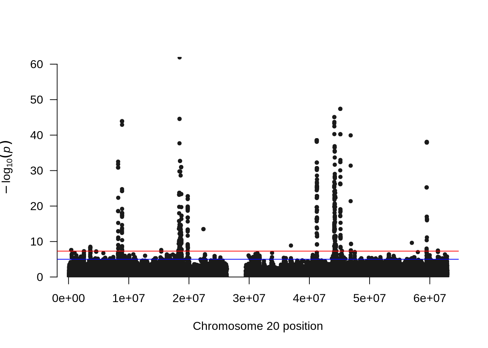

# GWAS with PLINK2

This tutorial demonstrates how to perform a **genome-wide association study (GWAS)** using **PLINK2**, with and without **principal component analysis (PCA)** adjustment.
We will use **imputed genotype data** obtained directly from the **[Michigan Imputation Server](https://imputationserver.sph.umich.edu/)**, which provides high-quality imputed datasets ready for association testing.
 
**In this tutorial, we will:**

* Load imputed genotype, phenotype, and covariate data
* Perform GWAS using PLINK2
* Compare association results with and without PCA adjustment
* Visualize findings using Manhattan and QQ plots

This workflow provides a complete introduction to conducting GWAS with imputed data, enabling accurate and efficient detection of genotype–phenotype associations.


::: {.cell}

:::


## GWAS on Phenotype 2

Phenotype 2 represents a continuous trait simulated to exhibit a strong underlying genetic component. Continuous phenotypes are commonly encountered in complex trait genetics, as they capture quantitative variation among individuals rather than discrete categories. Given the simulated genetic architecture of phenotype 2, we expected that genome-wide association analysis (GWAS) would reveal multiple significant loci contributing to the observed variation.

### GWAS Without PCA

First, we run a **linear regression GWAS** on the simulated phenotype **`pheno_2`** from the file **`phenotypes.txt`**, **without adjusting for population structure**.
This initial analysis provides a baseline to observe how population stratification may influence the association results before including principal components as covariates.


::: {.cell}

```{.bash .cell-code}
plink2 --vcf data/gwas.imputed.chr20.dose.vcf.gz --double-id \
  --pheno data/phenotypes.txt \
  --pheno-name pheno_2 \
  --linear allow-no-covars \
  --out output/gwas
```
:::


**Explanation:**

* `--vcf`: Input imputed genotype file in VCF format
* `--pheno`: Phenotype file (tab-delimited)
* `--pheno-name`: Selects the phenotype column to test (here `pheno_2`)
* `--linear allow-no-covars`: Runs linearr regression without covariates
* `--out`: Prefix for output files

After running the GWAS, we can visualize the results using **Manhattan** and **QQ plots** to better understand the distribution and significance of associations across the genome.


::: {.cell}

```{.r .cell-code}
library(qqman)
```

::: {.cell-output .cell-output-stderr}

```

```


:::

::: {.cell-output .cell-output-stderr}

```
For example usage please run: vignette('qqman')
```


:::

::: {.cell-output .cell-output-stderr}

```

```


:::

::: {.cell-output .cell-output-stderr}

```
Citation appreciated but not required:
```


:::

::: {.cell-output .cell-output-stderr}

```
Turner, (2018). qqman: an R package for visualizing GWAS results using Q-Q and manhattan plots. Journal of Open Source Software, 3(25), 731, https://doi.org/10.21105/joss.00731.
```


:::

::: {.cell-output .cell-output-stderr}

```

```


:::

```{.r .cell-code}
pheno_2 <- read.table("output/gwas.pheno_2.glm.linear", header = TRUE, comment.char = "")
pheno_2 <- pheno_2[!is.na(pheno_2$P), ]

# Manhattan plot
manhattan(x = pheno_2, chr = "X.CHROM", bp = "POS", p = "P", snp = "ID")
```

::: {.cell-output-display}
{width=672}
:::

```{.r .cell-code}
# QQ plot
qq(pheno_2$P)
```

::: {.cell-output-display}
{width=672}
:::
:::


**Notes:**

* The **`qqman`** package provides convenient functions to visualize GWAS results.
* The **Manhattan plot** displays all tested SNPs along chromosome 20, with the y-axis showing the –log₁₀(p-value). Peaks in the plot represent genomic regions with stronger association signals.
* The **QQ plot** compares the observed versus expected p-value distributions to assess potential inflation or systematic bias in the test statistics.
* In this unadjusted GWAS (without PCA correction), some inflation may appear, reflecting the effect of population structure or relatedness among individuals.

### PCA: Assessing Population Structure

Before including principal components (PCs) as covariates, let's visualize the PCA data.


::: {.cell}

```{.r .cell-code}
library(ggplot2)

pca_data <- read.table("data/covariates.txt", header = TRUE, comment.char = "")

ggplot(pca_data, aes(x = PC1, y = PC2)) +
  geom_point(alpha = 0.7) +
  theme_minimal() +
  labs(title = "PCA of Genotype Data", x = "PC1", y = "PC2")
```

::: {.cell-output-display}
{width=672}
:::
:::


**Explanation:**

* `covariates.txt` contains individual-level covariates including PCs (e.g., `IID`, `PC1`, `PC2`, …).
* The PCA plot can reveal population substructure or outliers.

### GWAS With PCA Adjustment

Next, include the PCA covariates in the GWAS to account for population stratification:


::: {.cell}

```{.bash .cell-code}
plink2 --vcf data/gwas.imputed.chr20.dose.vcf.gz --double-id \
  --pheno data/phenotypes.txt \
  --pheno-name pheno_2 \
  --covar data/covariates.txt \
  --linear hide-covar \
  --out output/gwas.covar
```
:::


**Explanation:**

* `--covar`: Provides a file containing covariates (e.g., PCs).
* `--linear hide-covar`: Runs linear regression while hiding covariate results in the output.

After running the GWAS, we can visualize the results using **Manhattan** and **QQ plots** to better understand the distribution and significance of associations across the genome.


::: {.cell}

```{.r .cell-code}
pheno_2 <- read.table("output/gwas.covar.pheno_2.glm.linear", header = TRUE, comment.char = "")
pheno_2 <- pheno_2[!is.na(pheno_2$P), ]

# Manhattan plot
manhattan(x = pheno_2, chr = "X.CHROM", bp = "POS", p = "P", snp = "ID")
```

::: {.cell-output-display}
{width=672}
:::

```{.r .cell-code}
# QQ plot
qq(pheno_2$P)
```

::: {.cell-output-display}
{width=672}
:::
:::


**Comparison Tip:**
Compare the QQ plots *before* and *after* including PCs to see how population structure adjustment affects the inflation of p-values.

## GWAS on Phenotype 4

Phenotype 4 was simulated as a continuous trait with no underlying genetic component. In this case, the variation in the phenotype arises entirely from environmental or random factors rather than genetic differences among individuals. As a result, we did not expect to detect any significant associations in the genome-wide association analysis (GWAS).


::: {.cell}

```{.bash .cell-code}
plink2 --vcf data/gwas.imputed.chr20.dose.vcf.gz --double-id \
  --pheno data/phenotypes.txt \
  --pheno-name pheno_4 \
  --covar data/covariates.txt \
  --linear hide-covar \
  --out output/gwas.covar
```
:::


::: {.cell}

```{.r .cell-code}
pheno_4 <- read.table("output/gwas.covar.pheno_4.glm.linear", header = TRUE, comment.char = "")
pheno_4 <- pheno_4[!is.na(pheno_4$P), ]

# Manhattan plot
manhattan(x = pheno_4, chr = "X.CHROM", bp = "POS", p = "P", snp = "ID")
```

::: {.cell-output-display}
{width=672}
:::

```{.r .cell-code}
# QQ plot
qq(pheno_4$P)
```

::: {.cell-output-display}
{width=672}
:::
:::


---

## References

* [PLINK2 Documentation](https://www.cog-genomics.org/plink/2.0/)
* [qqman R Package](https://cran.r-project.org/package=qqman)
* [ggplot2 R Package](https://ggplot2.tidyverse.org/)

